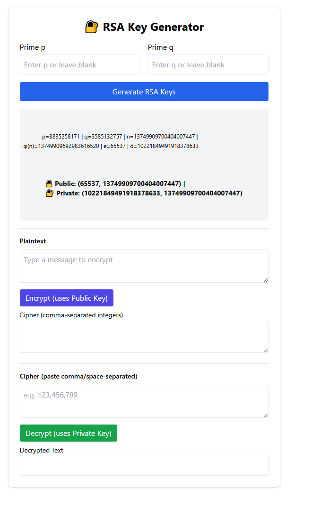
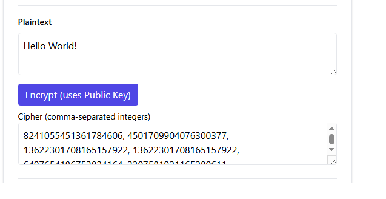
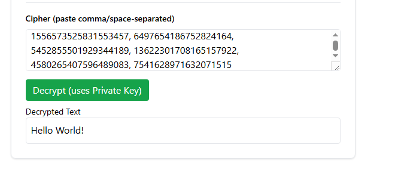

# RSA Visualizer

An **educational** RSA cryptography visualizer with a **TypeScript + Vite + Tailwind CSS** frontend and a **Python Flask** backend.  
This tool lets you **generate RSA keys**, **encrypt messages**, and **decrypt ciphertext** — while showing you all the important numbers (p, q, n, φ(n), e, d) for learning purposes.

---

## Table of Contents
1. [About the Project](#-about-the-project)
2. [Features](#-features)
3. [Tech Stack](#-tech-stack)
4. [Folder Structure](#-folder-structure)
5. [Getting Started](#-getting-started)
6. [API Documentation](#-api-documentation)
7. [Screenshots](#-screenshots)
8. [Notes](#-notes)

---

## About the Project
RSA is one of the most famous public-key cryptosystems, but it’s often taught in theory without hands-on experience.  
This project aims to make RSA **visual and interactive** by letting you:
- See how **p** and **q** create **n** and **φ(n)**
- Understand the roles of **e** (public exponent) and **d** (private exponent)
- Watch encryption and decryption happen step-by-step

It’s perfect for:
- **Students** learning cryptography
- **Educators** explaining public-key systems
- **Hobbyists** curious about number theory and modular arithmetic

---

## Features
- ** Key Generation**: Choose bit-length for primes (e.g., 16, 32, 64 bits).
- ** Encryption**: Convert text to integers and encrypt with `(e, n)`.
- ** Decryption**: Recover plaintext with `(d, n)`.
- ** Live Key Display**: See p, q, n, φ(n), e, d in real-time.
- ** Modern UI**: Built with Tailwind CSS for responsive design.
- ** Separation of Concerns**: Backend (Flask) for RSA math, Frontend (Vite + TS) for UI.

---

## Tech Stack

### **Frontend**
- [TypeScript](https://www.typescriptlang.org/)
- [Vite](https://vitejs.dev/) (bundler & dev server)
- [Tailwind CSS](https://tailwindcss.com/) (styling)

### **Backend**
- [Python 3](https://www.python.org/)
- [Flask](https://flask.palletsprojects.com/)
- [Flask-CORS](https://flask-cors.readthedocs.io/)

---

## Folder Structure
```graphql
rsa-visualizer/
│
├── backend/
│   ├── app.py           # Flask server & API routes
│   ├── rsa_utils.py     # RSA keygen,encryption,decryption
│   ├── requirements.txt # Python dependencies
│
├── src/
│   ├── main.ts          # Frontend logic
│   ├── components/      # TS modules
│   ├── style.css        # TailwindCSS styles
│
├── index.html           # Frontend HTML entry point
└── README.md
```


## Getting Started

### 1. Clone the repo
```bash
git clone https://github.com/your-username/rsa-visualizer.git
cd rsa-visualizer
```

### 2. Setup Backend
```bash
cd backend
python -m venv .venv
# Activate venv:
.venv\Scripts\activate    # Windows PowerShell
source .venv/bin/activate # Mac/Linux

pip install -r requirements.txt
python app.py

```

Runs at http://127.0.0.1:5000

### 3. Setup Frontend
```bash
cd ..
npm install
npm run dev
```
Runs at http://127.0.0.1:5173

## API Documentation

The backend is a **Flask-based REST API** that powers RSA key generation, encryption, and decryption.  
All endpoints accept and return **JSON**. By default, the server runs at: http://127.0.0.1:5000


---

### `POST /generate_keys`

Generates a new RSA keypair.

#### Request JSON (optional parameter bits_per_prime):

```json
{ "bits_per_prime": 32 }
```
#### Response JSON:
```json
{
  "p": 61,
  "q": 53,
  "n": 3233,
  "phi": 3120,
  "e": 17,
  "d": 2753
}
```

### POST /encrypt
Encrypts a plaintext message using the public key (e, n).

#### Request JSON:

```json
{
  "message": "HELLO",
  "e": 17,
  "n": 3233
}
```
#### Response JSON:
```json
{
  "cipher": [2790, 1313, 745, 745, 2185]
}
```
### POST /decrypt
Decrypts a list of integers using the private key (d, n).

#### Request JSON:
```json
{
  "cipher": [2790, 1313, 745, 745, 2185],
  "d": 2753,
  "n": 3233
}
```
#### Response JSON:
```json
{
  "plaintext": "HELLO"
}
```
---
### Screenshots

* **Generate RSA keys without filling any prime numbers.**
<p align="center">
  
</p>

* **Public & Private keys are generated, Pass secret message "Hello World!"**
  <p align="center">
  
  </p>


* **Recieved Cipher text, as message Encrypted, paste secret message in the decryption box and message indeed decrypted!**

  <p align="center">
  </p>

  ---
### Notes
* All requests and responses use JSON.

* CORS is enabled for easy frontend integration.

* This is for educational purposes only — not secure for real-world cryptography.

---
